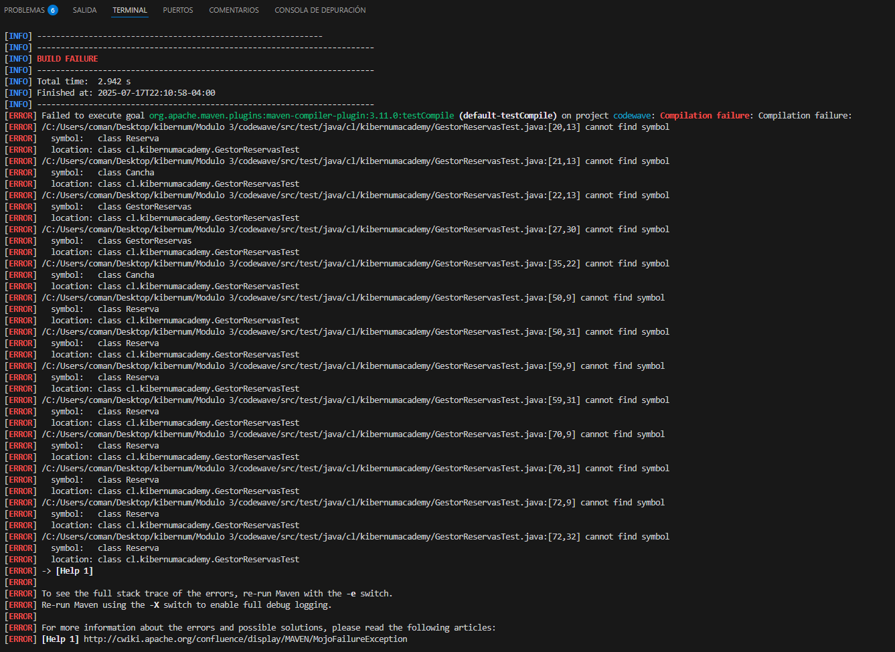
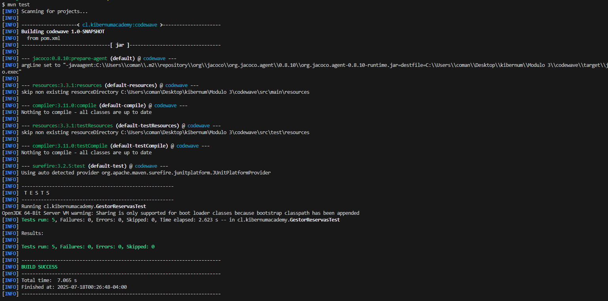
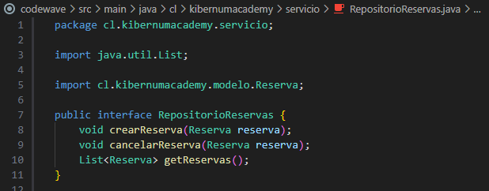
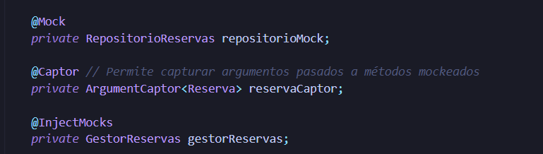
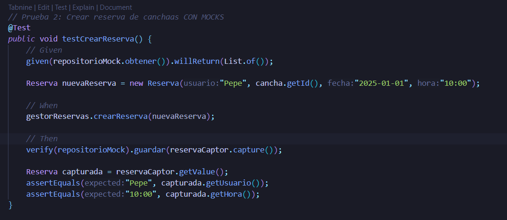
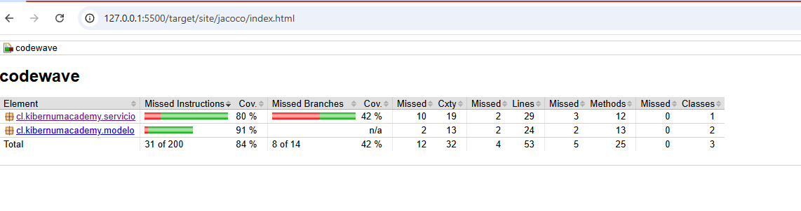
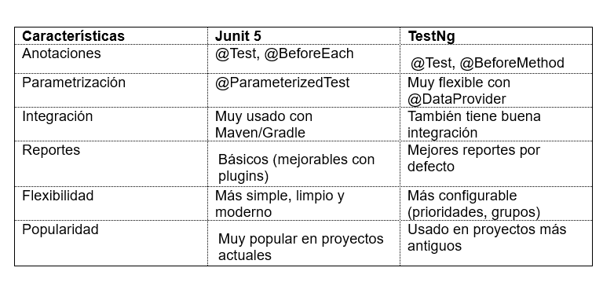

# Kibernum-Modulo3-Actividad5

# Testing de un Sistema de Notificaciones Utilizando Mockito

### Módulo 3 - Sesión 5 - Actividad 5

### Equipo 4: 
- Fabiola Díaz
- Felipe Lobos
- Eduardo Arellano
- Carlos Vasquez

## Gestor de Productos con JUnit 

### Actividad 1 : TDD y pruebas unitarias
### RED
Test en zona roja

[Código Zona roja](./src/test/java/cl/kibernumacademy/GestorReservasTestRed.md)

### GREEN
tests en zona verde

Código fuente en zona verde

[Código Zona verde](./src/main/java/cl/kibernumacademy/servicio/GestorReservasGreen.md)

### REFACTOR
tests

código refactorizado
[Código refactor](./src/main/java/cl/kibernumacademy/servicio/GestorReservasRefactor.md)

### Actividad 2 : Principios de diseño
*Principios Solid*
1. **Single responsability Principle**
Cada clase tiene una única responsabilidad bien definida:
Cancha → Representa los datos de una cancha.
Reserva → Modela la información de una reserva.
GestorReservas → Administra la lógica de negocio (crear, cancelar, contar reservas, etc.)

2. **Open/Closed Principle**
Las clases están abiertas a extensión pero cerradas a modificación.
Por ejemplo: **GestorReservas** se puede extender  pero no es necesario modificar su código para agregar nuevas funcionalidades.

3. **Dependency Inversion Principle**
Los módulos de alto nivel no deben depender de módulos de bajo nivel. Ambos deben depender de abstracciones.
**GestorReservas** (módulo de alto nivel) depende de una abstracción (RepositorioReservas) y no de una implementación concreta.

_________________________________________________________

*KISS*
"Hazlo lo más simple posible, pero no más simple."
- Las clases (Cancha, Reserva, GestorReservas) tienen pocos atributos y métodos simples.
- Se usan estructuras directas como List<> en lugar de estructuras complejas innecesarias.
- No se agregan capas ni abstracciones innecesarias desde el principio.

__________________________________________________________

*DRY*
"Evita la duplicación de código."
- Se aplica el principio DRY al reutilizar la lógica para filtrar o buscar reservas mediante expresiones stream(), evitando repetir el mismo código en distintos métodos. También se centraliza la lógica de negocio en GestorReservas

__________________________________________________________

*YAGNI*
"No implementes funcionalidades que no necesitas aún."
- No se anticipan funcionalidades que no han sido requeridas. Esto permite mantener el sistema liviano, enfocado y fácil de mantener.

### Actividad 3: Uso de Mocks con Mockito

Este proyecto muestra cómo utilizar **Mockito** para realizar pruebas unitarias en Java, enfocadas en simular el comportamiento de dependencias externas (como un repositorio) mediante **mocks**. 

La clase principal de prueba es `GestorReservasTest.java`, que contiene cinco pruebas unitarias implementadas con **JUnit 5** y **Mockito**.

---

## 📁 Archivo principal

- `GestorReservasTest.java`  
Contiene las pruebas que validan funcionalidades como el registro de canchas, creación y cancelación de reservas, manejo de reservas duplicadas y cálculo de reservas por día.

---

## ✅ Objetivos de la actividad

- Simular dependencias usando `@Mock`.
- Inyectar dependencias con `@InjectMocks`.
- Capturar argumentos con `@Captor`.
- Validar interacciones con `verify()` y `never()`.
- Simular respuestas con `given()` (Behavior-Driven Development).

---

## 🔍 Funcionalidades probadas

1. Registro de canchas.
2. Creación de reservas usando un mock de repositorio.
3. Cancelación de reservas.
4. Prevención de reservas en horarios ya ocupados.
5. Cálculo del número de reservas por día.

---

## 🖼️ Evidencias de ejecución de pruebas con Mockito y JUnit

A continuación se muestran capturas que evidencian el uso correcto de mocks, capturas de argumentos y verificación de interacciones en las pruebas:

  

  

  

---

### Actividad 4: Medición de cobertura

### Actividad 5: : ATDD y aceptación

**Historia de Usuario (modelo INVEST)**

Como usuario del sistema,
quiero reservar una cancha en un horario específico,
para asegurarme de que tendré acceso a la cancha cuando lo necesite.

**Criterios de Aceptación**

- La reserva solo es válida si el horario está disponible.
- Se debe lanzar un error si se intenta reservar un horario ocupado.
- Se debe poder contar la cantidad de reservas por día.

**Escenario de Prueba (BDD - Gherkin)**

Feature: Gestión de reservas de canchas

  Scenario: Realizar una reserva en un horario disponible
    Given una cancha con horario disponible a las 10:00
    When un usuario realiza una reserva para esa hora
    Then la reserva debe guardarse correctamente

  Scenario: Intentar reservar un horario ya ocupado
    Given una cancha ya reservada a las 10:00
    When otro usuario intenta reservar el mismo horario
    Then se debe lanzar una excepción indicando que el horario está ocupado

### Actividad 6: : Comparación entre frameworks de testing
Esta actividad tiene como objetivo comparar los frameworks de pruebas unitarias JUnit 5 y TestNG, considerando diversos criterios como anotaciones, parametrización, reportes, flexibilidad e integración.

**Elección Justificada**
Para este proyecto, se eligió trabajar con JUnit 5 debido a su enfoque moderno, claridad sintáctica y compatibilidad con herramientas actuales como JaCoCo, Mockito y Maven.

JUnit 5 facilita una escritura de pruebas limpia y mantenible.
Está completamente alineado con las buenas prácticas de desarrollo guiado por pruebas (TDD/ATDD).
La comunidad y documentación es extensa y está actualizada.

### Conclusión

Aunque **TestNG** ofrece una mayor flexibilidad en configuraciones avanzadas (como test por prioridad o dependencias entre métodos), **JUnit 5** es ideal para proyectos modernos, orientados a prácticas limpias y herramientas de automatización continua.

> Por lo tanto, **JUnit 5 es la mejor elección** para este módulo de reservas deportivas desarrollado bajo buenas prácticas de ingeniería de software.

