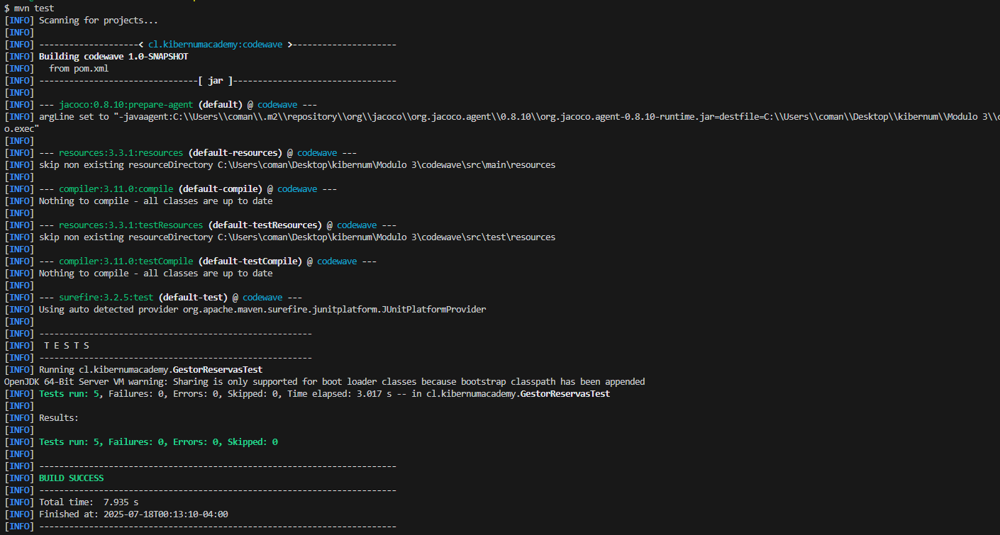

# Kibernum-Modulo3-Actividad5

# Testing de un Sistema de Notificaciones Utilizando Mockito

### Módulo 3 - Sesión 5 - Actividad 5

### Equipo 4: 
- Fabiola Díaz
- Felipe Lobos
- Eduardo Arellano
- Carlos Vasquez

## Gestor de Productos con JUnit 

### RED
Test en zona roja

[Código Zona roja](./src/test/java/cl/kibernumacademy/GestorReservasTestRed.md)

### GREEN
tests en zona verde

Código fuente en zona verde

[Código Zona verde](./src/main/java/cl/kibernumacademy/servicio/GestorReservaGreen.md)

### REFACTOR
tests

código refactorizado
[Código refactor](./src/main/java/cl/kibernumacademy/servicio/GestorReservaRefactor.md)
